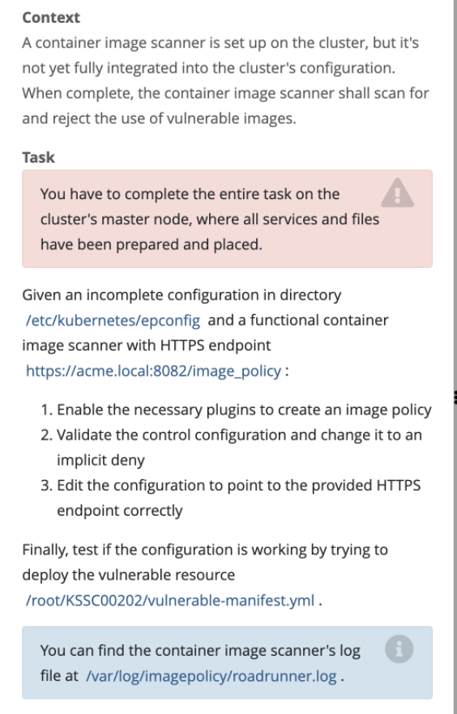

# ImagePolicyWebhook



## 官方文档：https://kubernetes.io/docs/reference/access-authn-authz/admission-controllers/#imagepolicywebhook


## <font color=red>在master节点操作</font>
## 0、epconfig目录文件
```shell
admission_config.yaml  apiserver-client-cert.pem  apiserver-client-key.pem  external-cert.pem  external-key.pem  kubeconf
```

## 1、修改 apiserver.yaml
```yaml
- --enable-admission-plugins=NodeRestriction,ImagePolicyWebhook
- --admission-control-config-file=/etc/kubernetes/epconfig/admission_configuration.yaml
```
## 2、mount
```yaml
# mount
    volumeMounts:
    - mountPath: /etc/kubernetes/epconfig
      name: epconfig
# 映射 volumes      
  volumes:
    - name: epconfig
    hostPath:
      path: /etc/kubernetes/epconfig
```

## 3、创建相对应的json或者yaml文件（admission_config.yaml）
```yaml
apiVersion: apiserver.config.k8s.io/v1
kind: AdmissionConfiguration
plugins:
- name: ImagePolicyWebhook
  configuration:
    imagePolicy:
    	kubeConfigFile: /etc/kubernetes/epconfig/kubeconf
      allowTTL: 50
      denyTTL: 50
      retryBackoff: 500
      defaultAllow: flase # 重点
```

## 4、修改kubeconf
```yaml
apiVersion: v1
kind: Config
clusters:
- cluster:
    certificate-authority: /etc/kubernetes/epconfig/external-cert.pem  # CA for verifying the remote service.
    server: https://acme.local:8082/image_policy # URL of remote service to query. Must use 'https'.
  name: image-checker

contexts:
- context:
    cluster: image-checker
    user: api-server
  name: image-checker
current-context: image-checker
preferences: {
    }

# users refers to the API server's webhook configuration.
users:
- name: api-server
  user:
    client-certificate: /etc/kubernetes/epconfig/apiserver-client-cert.pem # cert for the webhook admission controller to use
    client-key:  /etc/kubernetes/epconfig/apiserver-client-key.pem # key matching the cert
```

## 5、重启
```shell
systemctl daemon-reload

systemctl restart kubelet
```