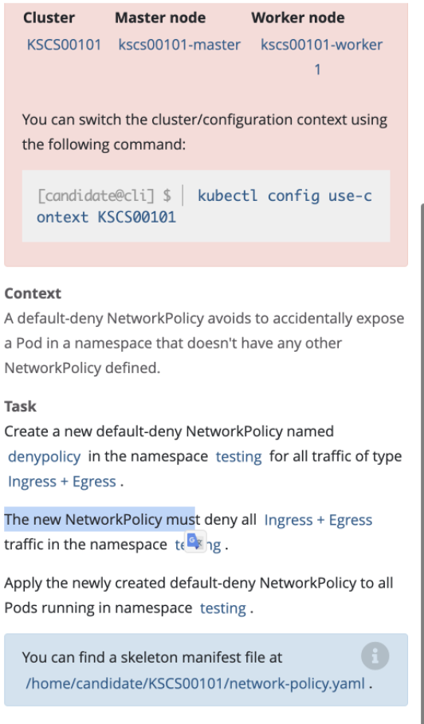
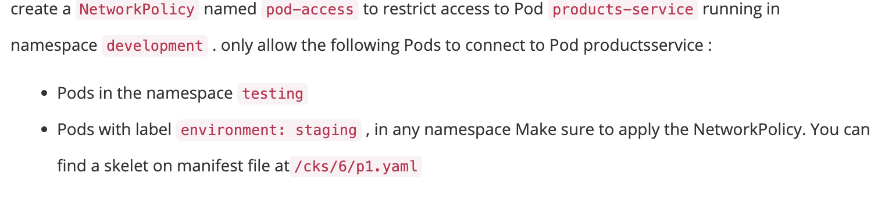

# Network Policy



官方文档：https://kubernetes.io/docs/concepts/services-networking/network-policies/

## 创建一个网络策略，来限制pod之前相互访问，默认的策略是pod之间，在不同的namespace是可以相互访问的

### 创建一个默认的deny all ingress

### 创建一个默认的deny all egress

### 创建一个默认的deny all ingress、egress

```yaml
---
apiVersion: networking.k8s.io/v1
kind: NetworkPolicy
metadata:
  name: denypolicy
  namespace: testing
spec:
  podSelector: {}
  policyTypes:
  - Egress
  - Ingress
```


```yaml
apiVersion: networking.k8s.io/v1
kind: NetworkPolicy
metadata:
  name: pod-access
  namespace: development
spec:
  podSelector:
    matchLabels:
      role: pod-xxx # pod的label
  policyTypes:
    - Ingress
  ingress:
    - from:
      - namespaceSelector:
          matchLabels:
            role: test # testing namespace 的label
    - from:
      - namespaceSelector: {} # 所有namespace
      - podSelector:
          matchLabels:
            enviroment: staging
```

