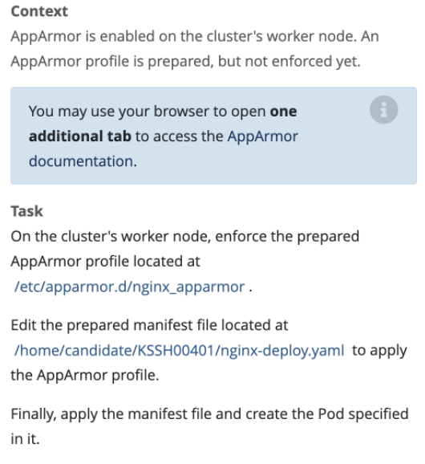

# AppArmor



## 官方文档：https://kubernetes.io/docs/tutorials/security/apparmor/


## 在node节点创建AppArmor使用的profile,并加载profile 文件

```shell
apparmor_parser /etc/apparmor.d/nginx_apparmor
```

## 创建pod

```yaml
apiVersion: v1
kind: Pod
metadata:
  name: hello-apparmor
  annotations:
    container.apparmor.security.beta.kubernetes.io/hello: localhost/nginx_apparmor # 重点是hello的容器和localhost/nginx_apparmor
spec:
  containers:
  - name: hello #和上面的hello对应
    image: busybox:1.28
    command: [ "sh", "-c", "echo 'Hello AppArmor!' && sleep 1h" ]
```