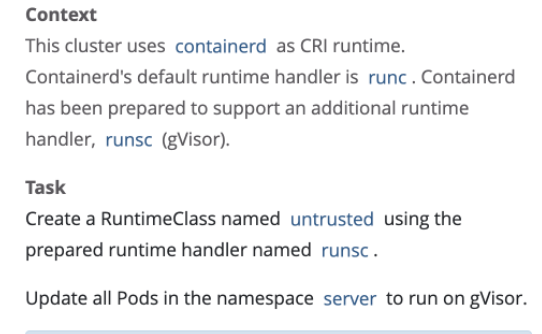

# Runtime Class


## 创建Runtime Class
```yaml
apiVersion: node.k8s.io/v1
kind: RuntimeClass
metadata:
  name: untrusted
handler: runsc
```
## 更新Pod中使用新的Runtime Class (handler)
### 导出yaml，添加runtimeClassName，重新创建