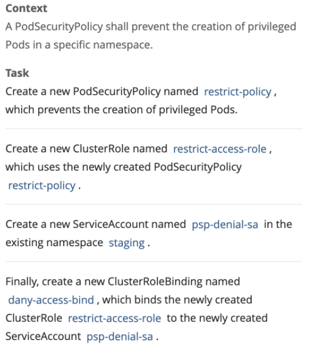

# PSP


## 官方文档：https://kubernetes.io/docs/concepts/policy/pod-security-policy/

## 创建新的psp

```shell
kubectl apply -f psp.yaml
```

## 创建clusterrole 使用psp

```shell
kubectl create sa psp-denial-sa -n staging
```

## 创建clusterrole
```shell
kubect create clusterrole restrict-access-role --verb use --resource psp --resource-name restrict-policy
```

## 创建clusterrolebinding
```shell
kubectl create clusterrolebinding dany-access-bind --clusterrole restrict-access-role --serviceaccount staging:psp-denial-sa
```
