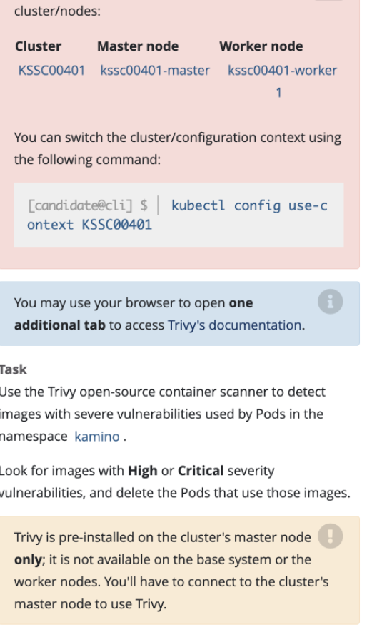

# Trivy



## 找出某个namespace下所有pod使用的image，并检测镜像
## Trivy在master节点，需要ssh到具体的master节点才行


```shell
# master节点执行
kubectl -n kamino get po -o jsonpath='{range .items[*]}{.metadata.name}{"\t"}{.spec.containers[*].image}{"\n"}{end}'

# 或者
kubectl get pods --namespace kamino --output=custom-columns="NAME:.metadata.name,IMAGE:.spec.containers[*].image"
```

```shell
# master节点执行
trivy image -s CRITICAL,HIGH nginx:latest
```

```shell
#控制台执行
kubectl delete po xxx
```