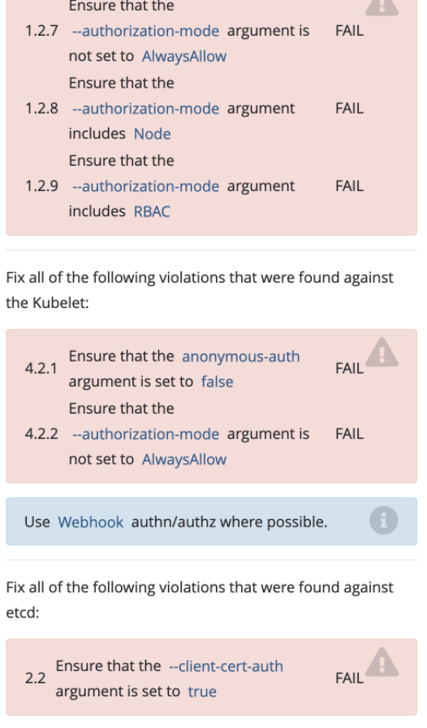

# kube-bench



## 0、在master节点执行kube-bench

```shell
kube-bench run node/master/etcd
```

## 1、在api server的配置文件修改：

```yaml
- --authorization-mode=Node,RBAC
- --insecure-port=0
#- --insecure-bind-address=0.0.0.0 # 删除
```

## 2、kubelet (/var/lib/kubelet/config.yaml) node节点
```yaml
apiVersion: kubelet.config.k8s.io/v1beta1
authentication:
  anonymous:
    enabled: false # 修改为false
  webhook:
    cacheTTL: 2m0s
    enabled: true
  x509:
    clientCAFile: /etc/kubernetes/pki/ca.crt
authorization:
  mode: Webhook # 修改为Webhook
  webhook:
    cacheAuthorizedTTL: 5m0s
    cacheUnauthorizedTTL: 30s
...
```

## 3、etcd.yaml (/etc/kubernetes/manifests/etcd.yaml )
```yaml
- --client-cert-auth=true
```

## 4、重启kubelet

```shell
service kubelet restart
```

