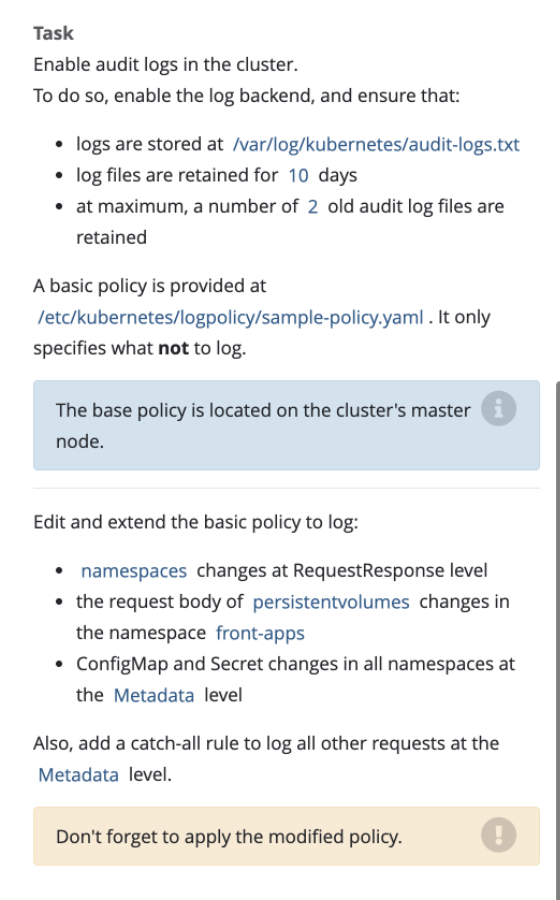

# Audit


## 官方文档：https://kubernetes.io/docs/tasks/debug-application-cluster/audit/

## 1、启用审计(master节点)

```yaml
- --audit-policy-file=/etc/kubernetes/audit-policy.yaml
- --audit-log-path=/var/log/kubernetes/audit-logs.log
- --audit-log-maxbackup=10 # defines the maximum number of audit log files to retain
- --audit-log-maxage=2 # defines the maximum size in megabytes of the audit log file before it gets rotate
```

挂载文件

```yaml
...
volumeMounts:
  - mountPath: /etc/kubernetes/audit-policy.yaml
    name: audit
    readOnly: true
  - mountPath: /var/log/kubernetes/audit/
    name: audit-log
    readOnly: false
```

```yaml
...
volumes:
- name: audit
  hostPath:
    path: /etc/kubernetes/audit-policy.yaml
    type: File

- name: audit-log
  hostPath:
    path: /var/log/kubernetes/audit/
    type: DirectoryOrCreate
```

## 2、修改对应的policy 文件
```yaml
apiVersion: audit.k8s.io/v1
kind: Policy
omitStages:
  - "RequestReceived"
rules:
  - level: RequestResponse
    resources:
    - group: ""
      resources: ["namespaces"]
  - level: Request
    resources:
    - group: ""
      resources: ["persistentvolumes"]
    namespaces: ["front-apps"]
  - level: Metadata
    resources:
    - group: ""
      resources: ["configmap", "secret"]
  - level: Metadata
    omitStages:
    - "RequestReceived"
```

## 3、重启kubelet
```shell
systemctl restart kubelet
```