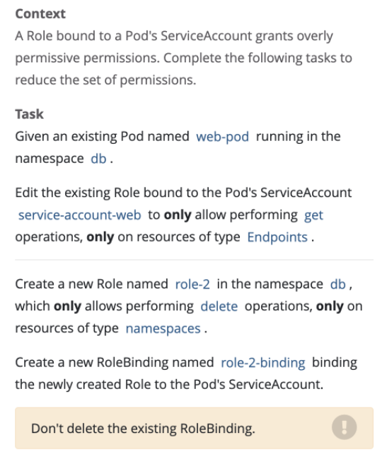

# Role/Rolebinding/Serviceaccunt



## 修改 Role
```shell
k create role role01 --resource=endpoints --verb get -n db
```

## 创建新的role
```
k create role role-2 --resource=namespaces --verb delete -n db
```

## 创建rolebinding
```shell
k create rolebinding role-2-binding --role role-2 --serviceaccount db:service-account-web
```